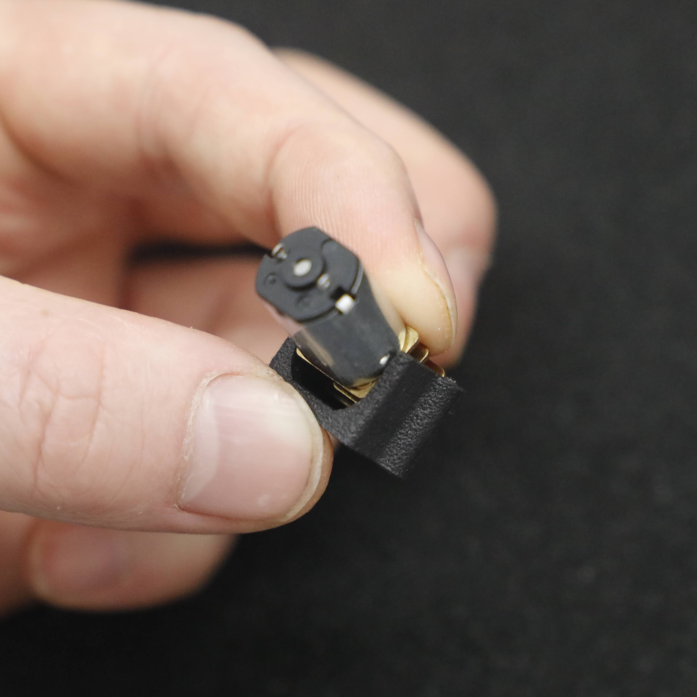
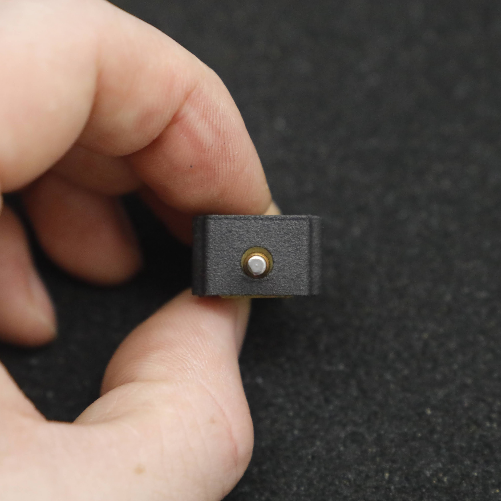

# N20 MOTOR CLAMP MOUNT v1.0 (2-pack)

 

Each CLAMP MOUNT is designed to rigidly mount a single N-series (N10 / N20 / N30) motor: orignially designed for insect weight combat robotics but is suitable as a sustitute mount for any application using these motors. 
  
This is a [New Zealand](https://www.google.co.nz/maps/place/Christchurch+New+Zealand) based product by [cb-technology](https://www.cb-technology.co.nz/), Connor Benton.

## FEATURES
- Easiest way to mount N-series (N10 / N20 / N30) motors.
- Mounts are threaded so does not require any additional nuts.
- Internal recesses have been added to provide clearance for the protruding gears of the N-series gearboxes.
- Screw mounting points are recessed back from the front to enable mounting closer to the edge. 
- *Delayed due to shipping issues but coming soon in v1.1:* bushing on output shaft to protect the notoriously weak gearbox. 

## SPECIFICATIONS
- **Dimensions:** 20x13.4x12 mm
- **Weight:** 1g each
- **Material:** Nylon 20
- **Thread Engagement:** 12mm 
- **Included in Package:** 2x Mounts, 4x M2 Cap Screws.

## INSTALLATION

1. Drill the holes in your material, using the attached pattern as a guide.

    

2. Seat the motor gearbox into the clamp as pictured below. 

    

3. Push the motor into the clamp mount. This step may require a little more force than initially anticipating. While pressing the motor into place, ensure that the front face of the gearbox remains hard against the corresponsing internal wall. 

    

4. Don't worry if the shaft is slightly not concentric in the cutout (as pictured below). When mounted this compresses down, holding the motor snugly in place and positioning the shaft correctly. 

    

5. Mount with clamp, using the holes cutout earlier.
6. Smash some bot!

