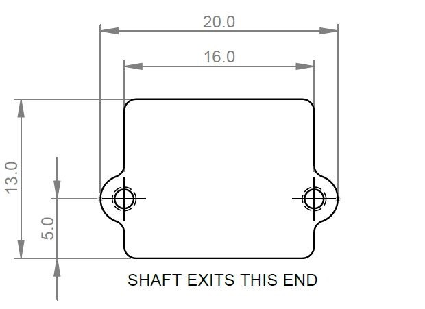

# N20 MOTOR CLAMP MOUNT v1.1 (2-pack)

 

Each clamp mount is designed to easily and securely fasten any N-series motor (N10 / N20 / N30) to your desired chassis frame.

This product was orignially designed for insect-weight combat robotics, but it is suitable as a sustitute motor mount for any application. 
  
This is a [New Zealand](https://www.google.co.nz/maps/place/Christchurch+New+Zealand) based product by [cb-technology](https://www.cb-technology.co.nz/), Connor Benton.

## FEATURES
- Easiest way to mount N-series motors (N10 / N20 / N30).
- Mount bodies are threaded so does not require any additional nuts.
- Internal recesses have been added to the clamp to provide clearance for the protruding gears of the N-series gearboxes.
- Optional bushing on the motor output shaft; improve the strength of the notoriously weak gearbox. 
- Lightweight and strong nylon body construction.

## SPECIFICATIONS
- **Dimensions:** 20x13x12 mm
- **Weight:** 1g each
- **Material:** Nylon 20
- **Thread Engagement:** 12mm 
- **Included in Package:** 2x Mounts, 4x M2 Cap Screws.

## INSTALLATION

1. Drill the holes in your chassis, using the attached pattern as a guide.

    

2. Seat the front of the motor into the clamp and press the rear down until seated as pictured below 

    

3. If you want to install the output, nows the time. Slide it onto the shaft, with the thinner side inward, and press it into place until fully seated against the clamp.

4. Mount with clamp, using the holes cutout earlier.
5. Smash some bot!

